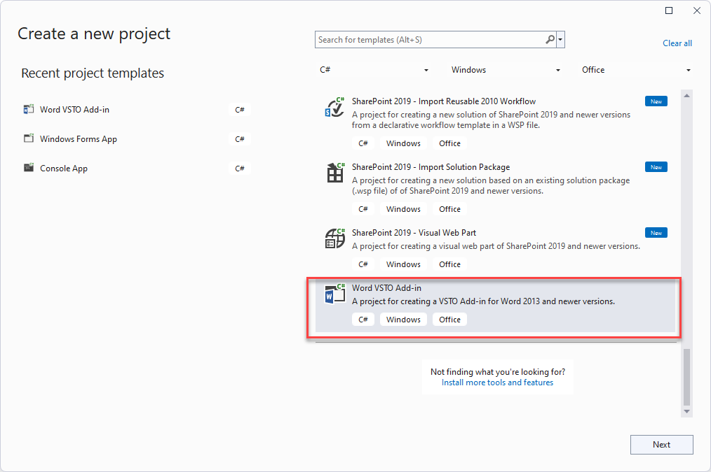
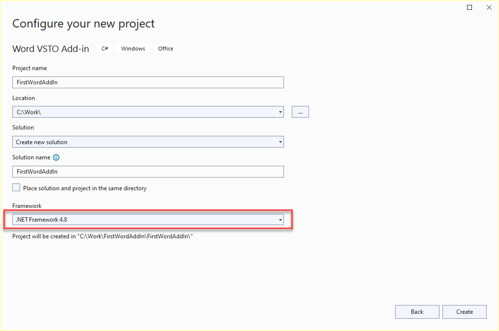
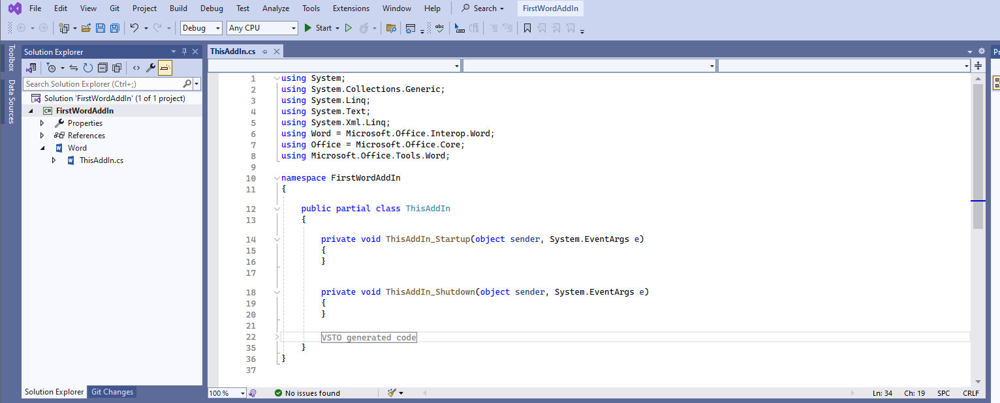

# First-Word-AddIn
This project shows you how to create a VSTO Add-in for Microsoft Office Word.

## Summary
This project is created by following **[Walkthrough: Create your first VSTO Add-in for Word](https://learn.microsoft.com/en-us/visualstudio/vsto/walkthrough-creating-your-first-vsto-add-in-for-word?view=vs-2022&tabs=csharp)**.

## Create the project
To create a new Word VSTO Add-in project in Visual Studio:
1. Start `Visual Studio 2022`.
2. On the File menu, point to New, and then click Project.
3. In the templates pane, expand `Visual C#`, and then expand `Office`.
4. In the list of project templates, select a `Word VSTO Add-in` project.
  
5. In the Name box, type **FirstWordAddIn**.
  
6. Click OK.

Visual Studio creates the **FirstWordAddIn** project and opens the `ThisAddIn` code file in the editor.

